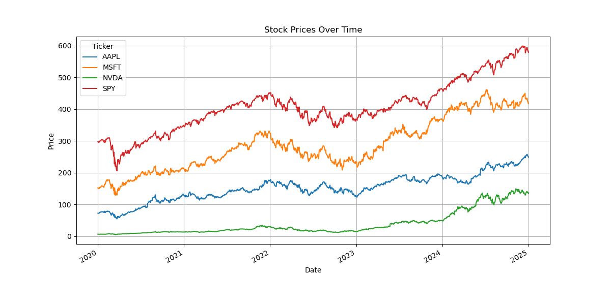
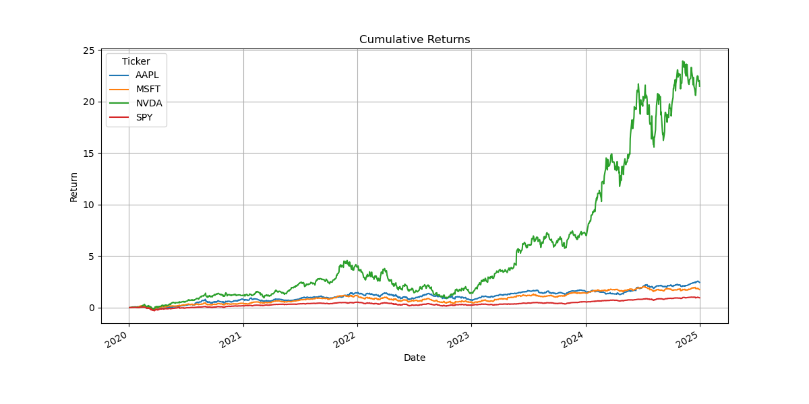
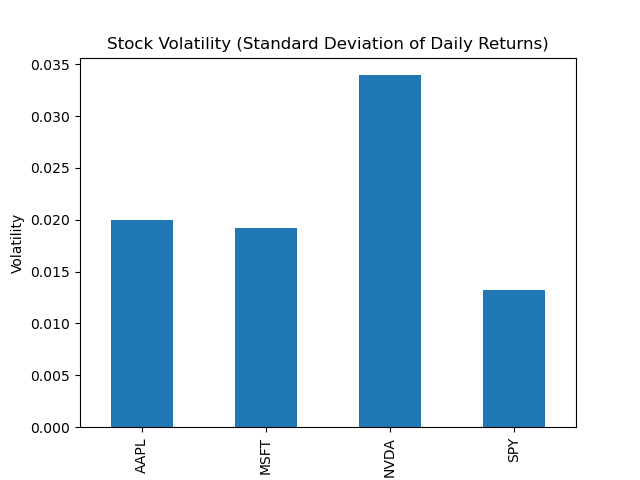

# Stock Market Data Analysis (Python)

## Overview

This project analyzes historical stock market data using Python to compare the performance of major technology companies and the broader market. Using financial time-series data, the analysis calculates returns, measures volatility, and visualizes price trends.

The goal of the project is to demonstrate practical data analysis skills relevant to economics, finance, and data analyst roles.

---

## Tools & Technologies

- Python
- Pandas
- yfinance
- Matplotlib
- Jupyter Notebook

---

## Stocks Analyzed

The analysis focuses on the following assets:

- AAPL — Apple
- MSFT — Microsoft
- NVDA — NVIDIA
- SPY — S&P 500 ETF (market benchmark)

Time period analyzed:

2020 – 2025

---

## Analysis Performed

The project performs several financial data analysis tasks:

- Download historical stock price data using Yahoo Finance
- Extract closing prices for each asset
- Calculate daily returns
- Calculate cumulative returns
- Measure stock volatility
- Generate charts to compare performance

---

## Visualizations and Interpretation

### Stock Price Trends



**Interpretation**

Technology stocks experienced strong price growth over the analyzed period. NVIDIA shows particularly rapid growth compared with the other companies. SPY, which represents the broader market, grows more steadily but at a slower rate than the individual technology stocks.

---

### Cumulative Returns



**Interpretation**

The cumulative return chart illustrates how a $1 investment in each asset would have grown over time. NVIDIA significantly outperforms the other assets, indicating strong long-term growth. Apple and Microsoft also show strong performance relative to the broader market. SPY grows more slowly but reflects the diversified performance of the overall market.

---

### Volatility Comparison



**Interpretation**

Volatility measures the variability of daily returns and is commonly used as a proxy for investment risk. The technology stocks exhibit higher volatility compared with SPY, indicating greater price fluctuations. This reflects the higher growth potential but also higher risk associated with individual technology stocks compared to a diversified market index.

---

## Project Structure

```
stock-market-data-analysis-python
│
├── data
│   └── stock_data.csv
│
├── images
│   ├── stock_prices.png
│   ├── cumulative_returns.png
│   └── volatility.png
│
├── notebook
│   └── stock_market_analysis.ipynb
│
├── src
│   └── analysis.py
│
└── requirements.txt
```

---

## Key Takeaways

Technology stocks experienced strong growth during the selected period but also exhibited higher volatility compared with the broader market benchmark (SPY). This project demonstrates how Python can be used for financial time-series analysis and visualization using publicly available market data.

---

## Skills Demonstrated

- Financial data analysis
- Time-series analysis
- Python data manipulation (pandas)
- Financial return calculations
- Data visualization with matplotlib
- Project organization and reproducible analysis

---

## Requirements

Install required libraries with:

```
pip install -r requirements.txt
```

---

## Author

Nicholas Mackinnon  
Economics Student — Data & Financial Analysis Portfolio
